############## Step to realise the project #################

1/ Clone du static-website-example dans mon repertoire Mini-projet

#git clone https://github.com/diranetafen/static-website-example.git

2/Creation du Dockerfile

touch Dockerfile => voir contenu dans le fichier Dockerfile

3/Creation du projet dans jenkins

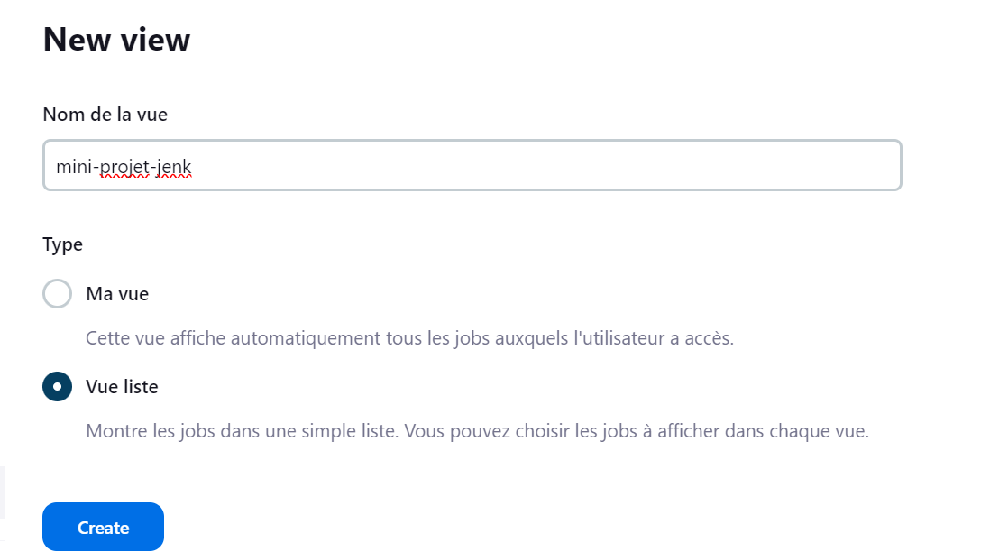

4/Creation de l'item website-projet en mode Pipeline

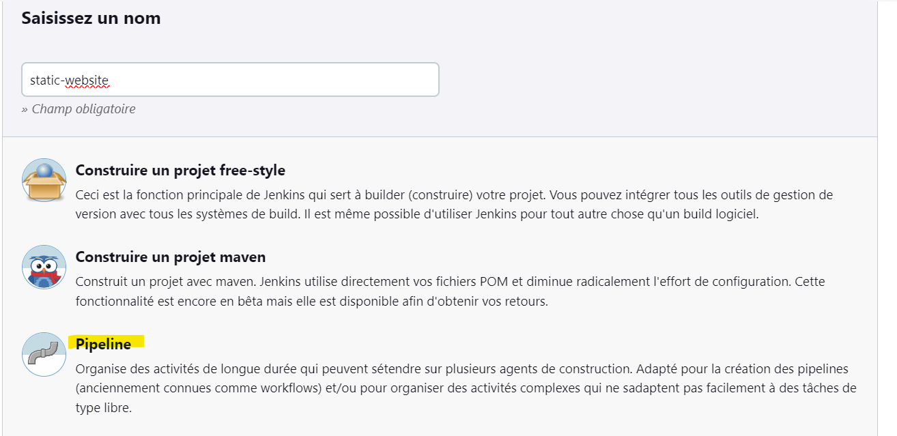

5/ Creation du parametre port
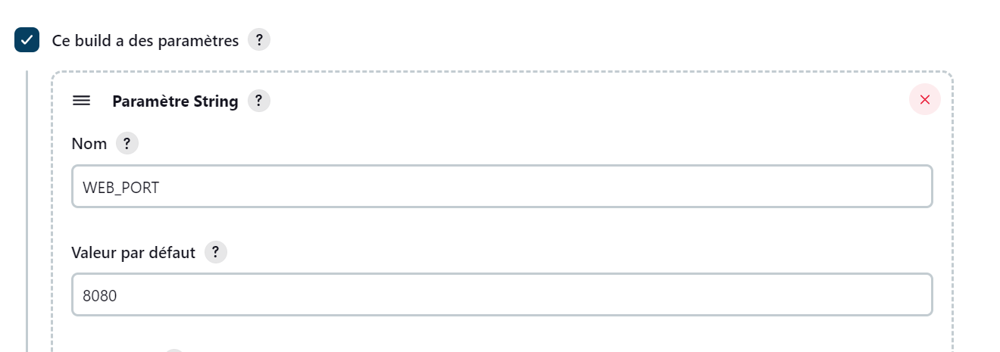

6/Creation du Jenkinsfile
#touch Jenkinsfile => voir contenu dans le fichier Jenkinsfile

7/Push et commit dans github local 
    - Creation du projet mini-proj-jenk
    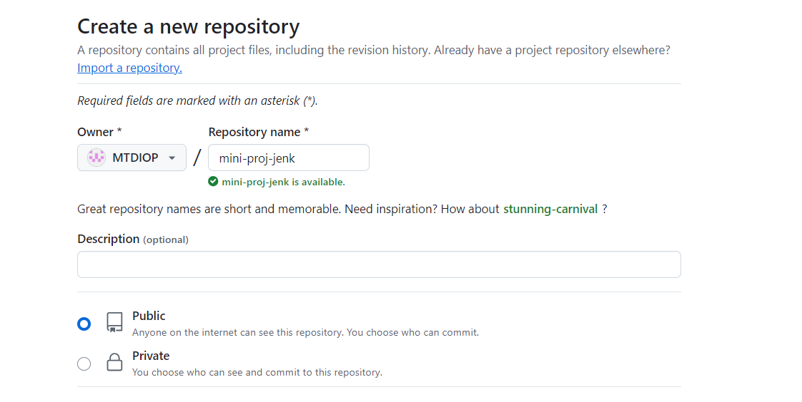

     - Change git origin de mon repertoire Mini-Projet 
 #git remote set-url origin git@github.com:MTDIOP/mini-proj-jenk.git

    - Commit et push 
#git add .
#git commit -m "add Dockerfile and jenkinsfile"
#git push

8/Configuration du github projet URL dans Jenkins
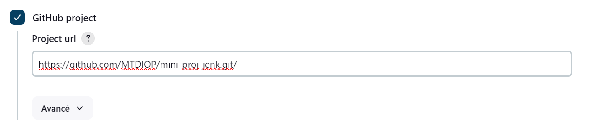

9/Definition du script Pipeline
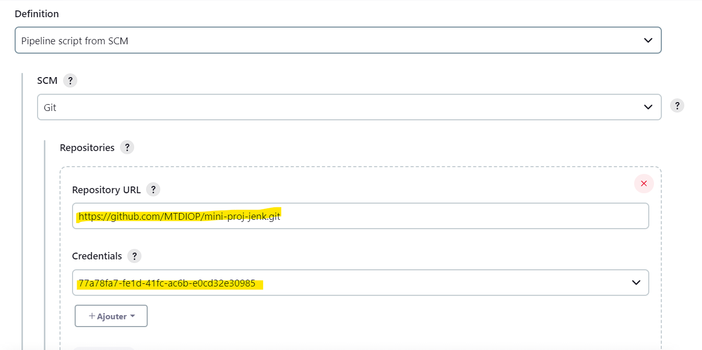

10/Ajout des secrtes file du dockerhub et de heroku_api_key
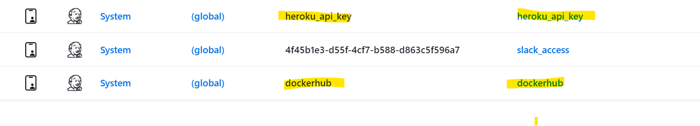

11/ Ajout de Embeddable Build Status Icon

#LocalHost

#Ngrok URL

https://06cc-37-67-97-149.ngrok-free.app/job/static-website/badge/icon)](https://06cc-37-67-97-149.ngrok-free.app/job/static-website/)

12/Add Slack Notif
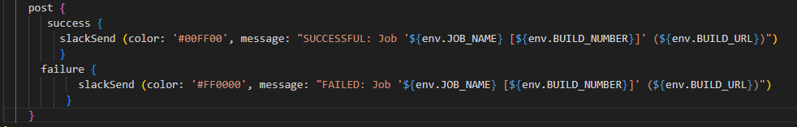

############## Result after realise the project #################

Jenkins Build Status
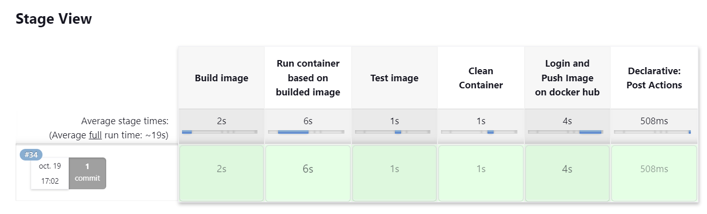

Docker Hub Status
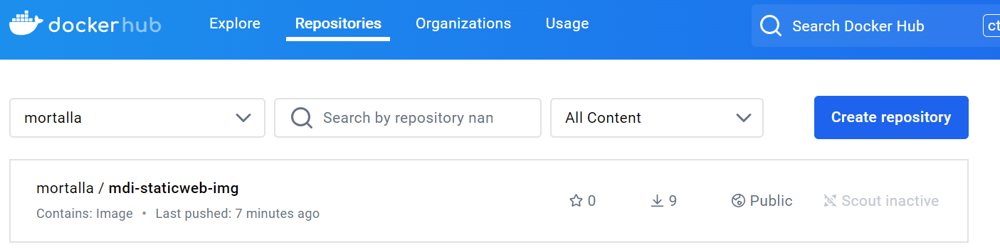

Heroku Status
NA

Slack Message

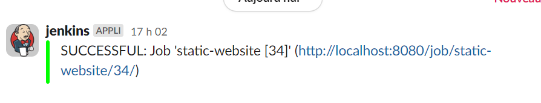