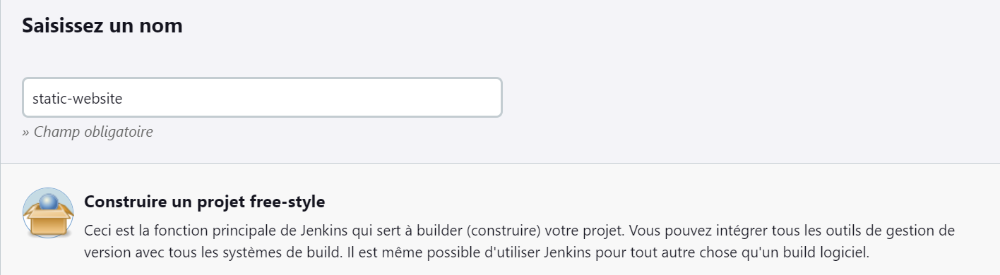

1/ Clone du static-website-example

#git clone https://github.com/diranetafen/static-website-example.git

2/Creation du Dockerfile

touch Dockerfile => voir contenu dans le fichier Dockerfile

3/Creation du projet dans jenkins

4/Creation de l'item website-projet en mode Freestyle

5/ Creation du parametre port

6/Creation du Jenkinsfile
#touch Jenkinsfile => voir contenu dans le fichier Jenkinsfile

7/Push et commit dans github local

